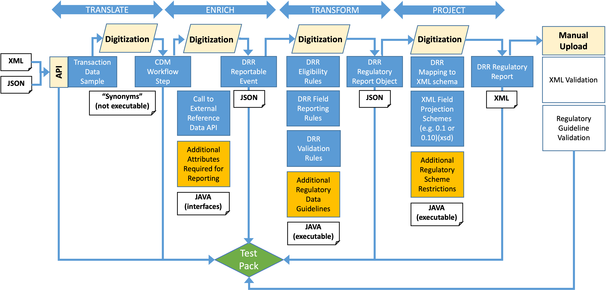

Overview
========

The Global Digital Regulatory Reporting (DRR) programme is a cross industry initiative to transform the reporting infrastructure so that all reporting entities implement rules consistently and cost effectively. DRR achieves this by delivering an open-source, functional expression of the reporting rules that can be used as machine-executable code in firms’ own implementations.

DRR is built as an extension of the `Common Domain Model <https://cdm.finos.org>`_ (CDM). It uses the CDM to represent the transaction data input into the reporting process. It conforms to the CDM’s design principles where data and functions are used to model reportable fields and logic, respectively.

More information about the DRR programme can be found by searching for `Digital Regulatory Reporting <https://www.isda.org/tag/digital-regulatory-reporting/>`_ on the ISDA website.

Background
----------

Financial institutions are subject to an array of global reporting obligations designed to provide transparency about their activities to regulators and ensure the safe functioning of financial markets, including the monitoring of systemic risk or market abuse. Derivatives transactions, following the global financial reform initiated in 2009, are now transparently reported to trade repositories across all G20 jurisdictions. More recently, similar reporting obligations have been extended to the Securities Financing markets.

Since they were first implemented, the regulatory community has progressed to harmonise global trade reporting rules under the Committee on Payments and Market Infrastructures (CPMI) and the International Organization of Securities Commissions (IOSCO) working groups of the Bank for International Settlements (BIS). National regulators and reporting parties have been tasked with implementing these recommendations consistently across global markets.

DRR supports that next wave of derivatives reporting regulations, allowing firms to comply efficiently and cost effectively and regulators to achieve their policy goals. The CDM has demonstrated that it can serve as the basis for this new reporting paradigm. Previous implementations that led up to this DRR program include the `UK Digital Regulatory Reporting Pilot <https://www.isda.org/2019/05/21/isda-cdm-deployed-to-help-deliver-uk-digital-regulatory-reporting-pilot/>`_ initiative in 2019 and the `G20 TechSprint <https://www.isda.org/2020/10/06/isda-and-regnosys-win-g-20-techsprint-for-regulatory-reporting/>`__ in 2020.

Scope and status
----------------

DRR covers several trade & transaction reporting regimes that have been developed through various implementation initiatives, each at different stages of maturity.

The following table captures the list of regimes covered and their implementation stage (as of June 1\ :sup:`st` 2022).

+---------------+-------------------------+----------------------------+
| **Regime**    | **Initiative**          | **Status**                 |
+===============+=========================+============================+
| CFTC Rewrite  | Global DRR Program      | Delivered – Extensive      |
|               |                         | coverage                   |
+---------------+-------------------------+----------------------------+
| EMIR Refit    | Global DRR Program      | In progress – Good         |
|               |                         | coverage                   |
+---------------+-------------------------+----------------------------+
| EMIR          | UK DRR Pilot            | Proof-of-concept           |
+---------------+-------------------------+----------------------------+
| MiFIR         | UK DRR Pilot            | Proof-of-concept           |
+---------------+-------------------------+----------------------------+
| MAS           | G20 TechSprint          | Proof-of-concept           |
+---------------+-------------------------+----------------------------+

Process overview
----------------

DRR consists of a sequence of 4 steps:

- **Translate**. This takes a firm’s transaction event data and translates it into a CDM object representing that transaction.

- **Enrich**. This enriches a CDM transaction event object with additional information obtained from an internal or external reference data source.

- **Transform**. This takes the enriched CDM transaction event object and applies the reporting logic (field rules plus any additional regulatory data guidelines) to produce a CDM report object containing all the reportable fields. The output object is also being evaluated against a set of mandated data validation rules.

- **Project**. This takes a CDM report object and applies additional mapping and projection rules to produce a report file in the format required by trade repositories and/or regulators (e.g. XML, ISO 20022).

DRR extends the CDM by modelling each of the above steps. The DRR output includes generated machine-executable code required by an implementor to run each step. Synthetic data samples for each step’s input and output are captured in a “Test Pack” that allows to validate any implementation against those tests.
